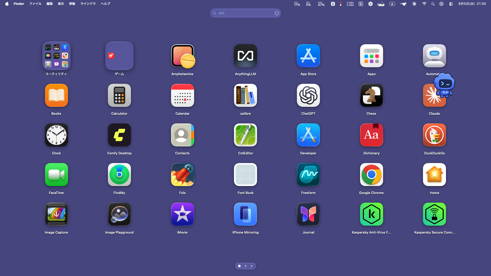

# Launchpad Classic for macOS

[](https://github.com/Hamzimer/launchpad-classic-macos/actions/workflows/ci.yml)
[](https://support.apple.com/macos)
[](LICENSE)

A native SwiftUI application launcher that brings the classic macOS Launchpad experience to current macOS releases.

日本語の説明は[こちら](#日本語)です。

> [!NOTE]
> This is an independent open-source project. It is not affiliated with or endorsed by Apple Inc. Apple, macOS, and Launchpad are trademarks of Apple Inc.

## Introduction

Launchpad Classic is a native macOS application launcher for people who want the familiar, direct experience of the classic Launchpad on newer macOS releases. Open it to see every installed application in a clean full-screen grid over your Desktop wallpaper, then launch an app with one click. There is no account, cloud service, analytics system, or network dependency: application discovery, organization, search, and preferences all remain on your Mac.

The launcher automatically scans the standard macOS application locations and watches them for changes. Newly installed apps appear without a manual refresh, removed apps disappear automatically, and the number of pages adapts to the size of the library. Pages can be changed with a mouse drag, scroll wheel, trackpad gesture, or the page indicators at the bottom of the screen. The search field filters the library immediately, while the adjacent settings control provides quick access without relying on the macOS menu bar.

Organization works like the classic Launchpad. Drag one app onto the center of another to create a folder, edit the folder name directly, rearrange its contents, or drag an app back out. Folder panels grow according to their contents so icons remain visible and begin at the top row. Common macOS Utilities and App Store games can be grouped automatically, and every custom folder, name, order, page arrangement, icon size, language choice, and background preference is restored after relaunching or installing a newer version.

The interface is designed to feel at home on macOS: a borderless full-screen presentation, Desktop-wallpaper background and blur options, Retina-density icons, responsive animations, keyboard dismissal with Escape, and background-click dismissal. It supports English, Japanese, and automatic system-language selection, respects Reduce Motion, includes VoiceOver labels, and adopts native Liquid Glass controls on macOS 26 or later. First-page assets are prepared before presentation to avoid an empty startup frame, while bounded caches and automatic memory-pressure eviction keep repeated launches fast without allowing image memory to grow indefinitely.

## Highlights

- Full-screen, borderless launcher with blurred desktop wallpaper
- Preloaded first presentation without an empty full-screen frame
- Automatic paging based on the number of installed applications
- Automatic refresh when applications are installed or removed
- Smooth mouse-drag, mouse-wheel, trackpad, and page-dot navigation
- Adjustable application icon sizes from 60 to 112 points
- Retina-density application icons with high-quality scaling
- Drag one application onto another to create a folder
- Rename folders, rearrange their contents, and drag applications back out
- Adaptive folder canvas that prevents icons from overflowing
- Automatic Utilities grouping and App Store game grouping
- Search, automatic application detection, wallpaper selection, and display settings
- English by default, with Japanese and automatic system-language modes
- Native Liquid Glass controls on macOS 26 and later
- Reduce Motion and VoiceOver support
- 0.25-second fade-and-zoom closing motion modeled after classic Launchpad behavior
- Bounded, pressure-evictable image caches for predictable memory use and instant reopening
- Local-only operation with no analytics or network service

## Screenshot



## Requirements

- macOS 14 Sonoma or later
- Apple Silicon or Intel Mac
- Swift 6 command-line tools when building from source

## Install

1. Download `LaunchpadClassic-3.12.0.pkg` from the [latest release](../../releases/latest).
2. Quit a running older version, then open the installer.
3. The installer replaces `/Applications/Launchpad Classic.app` while preserving folders and settings stored in your user account.

The ZIP release remains available for manual installation. Every release contains the same `Launchpad Classic.app` name so it can replace the existing copy.

The downloadable build is locally signed. If macOS blocks the first launch, Control-click the application in Finder, choose **Open**, and confirm once.

## Build from source

```sh
git clone https://github.com/Hamzimer/launchpad-classic-macos.git
cd launchpad-classic-macos
./build-app.sh
open "dist/Launchpad Classic.app"
```

The release build is Universal 2 and runs natively on Apple Silicon and Intel Macs.

## Tests

```sh
./run-quality-tests.sh
```

The standalone quality suite covers preference sanitization, duplicate data, invalid drag input, folder creation and removal, folder-name persistence, modal interaction, dismissal motion, page boundaries, compact layout geometry, inaccessible scan roots, automatic application-directory monitoring, bounded image caches, and unsafe deletion paths.

## Privacy

Launchpad Classic scans and locally monitors application folders, and scans macOS wallpaper locations, to build its launcher. It does not contain analytics, advertising, online accounts, API keys, or telemetry.

## License

Released under the [MIT License](LICENSE).

---

## 日本語

Launchpad Classicは、従来のmacOS Launchpadに近い操作感を、現在のmacOSで再現するSwiftUI製アプリケーションランチャーです。

### はじめに

Launchpad Classicは、従来のLaunchpadが持っていた「開けばすぐにすべてのアプリが見つかる」という分かりやすさを、現在のmacOSで利用するためのネイティブアプリです。起動するとDesktopの壁紙を背景に、インストール済みアプリを全画面のグリッドで表示します。アカウント登録、クラウドサービス、解析、広告、外部通信を必要とせず、アプリの検出、検索、並べ替え、設定の保存はすべてMac内で完結します。

標準のアプリケーションフォルダーを自動監視するため、新しいアプリをインストールすると手動更新なしで一覧に加わり、削除されたアプリも自動的に取り除かれます。アプリ数に応じてページ数が増減し、マウスで左右にドラッグする操作、ホイール、トラックパッド、画面下部のページドットで滑らかに移動できます。検索欄では入力と同時にアプリを絞り込み、その横の設定ボタンから表示や背景をすぐに変更できます。

アプリを別のアプリの中央へドラッグするとフォルダーを作成でき、フォルダー名の直接編集、中の並べ替え、フォルダー外への取り出しに対応します。フォルダーの表示領域はアプリ数に合わせて変化し、アイコンは上段から整列します。macOS標準のユーティリティやApp Storeのゲームも自動的にグループ化できます。作成したフォルダー、名称、並び順、ページ構成、アイコンサイズ、言語、背景は、アプリを終了した後や新しいバージョンを上書きインストールした後も引き継がれます。

UIは、枠のない全画面表示、Desktop壁紙とぼかし、Retina解像度のアイコン、滑らかなページアニメーション、Escキーと背景クリックによる終了など、macOSらしい操作感を重視しています。英語、日本語、システム言語の自動選択に対応し、VoiceOverと「視差効果を減らす」を尊重します。macOS 26以降ではネイティブのLiquid Glassコントロールを使用します。初期ページの素材を表示前に準備することで空の起動画面を抑え、上限付きキャッシュとメモリプレッシャー時の自動解放によって、高速な再表示と省メモリを両立しています。

### 主な機能

- インストール済みアプリ数に応じた自動ページ作成
- 空の全画面を表示しない初期ページの事前読込
- アプリのインストール／削除を検知した一覧の自動更新
- マウスドラッグ、ホイール、トラックパッド、ページドットによる移動
- アプリアイコンサイズの変更
- Retina解像度と高品質補間による滑らかなアイコン表示
- アプリ同士のドラッグによるフォルダー作成
- フォルダー名の変更、並べ替え、フォルダー外への移動
- アイコン数に応じて変化するフォルダー表示領域
- ユーティリティとApp Storeゲームの自動グループ化
- アプリ検索、新規アプリの自動検出、背景選択、表示設定
- 英語を初期設定とし、日本語とシステム言語の自動選択にも対応
- macOS 26以降のLiquid Glass対応
- VoiceOverと「視差効果を減らす」設定への対応
- クラシックなLaunchpadに近い終了アニメーション
- 上限付きでメモリ負荷に応じて解放される画像キャッシュによる省メモリ設計と高速な再表示
- 外部通信、広告、解析、テレメトリーなし

### インストール

1. [最新リリース](../../releases/latest)から`LaunchpadClassic-3.12.0.pkg`をダウンロードします。
2. 実行中の旧バージョンを終了し、インストーラを開きます。
3. `/Applications/Launchpad Classic.app`が上書きされ、ユーザー領域に保存されたフォルダー構成と設定は引き継がれます。

手動インストール用のZIP版も利用できます。今後のリリースは常に同じ`Launchpad Classic.app`名を使用します。

初回起動がmacOSにより止められた場合は、FinderでAPPをControl＋クリックし、「開く」を選択してください。

### ソースからビルド

```sh
git clone https://github.com/Hamzimer/launchpad-classic-macos.git
cd launchpad-classic-macos
./build-app.sh
```

テストは`./run-quality-tests.sh`で実行できます。
